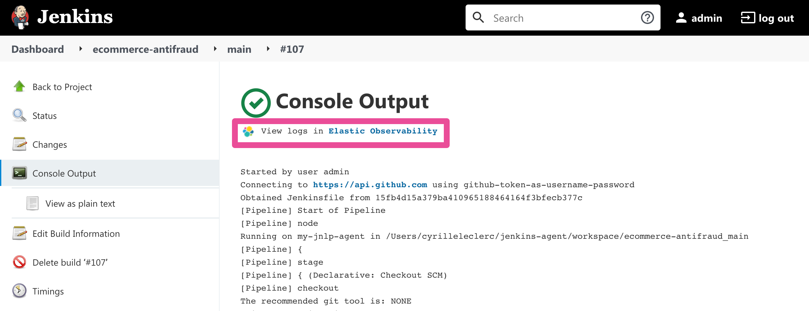
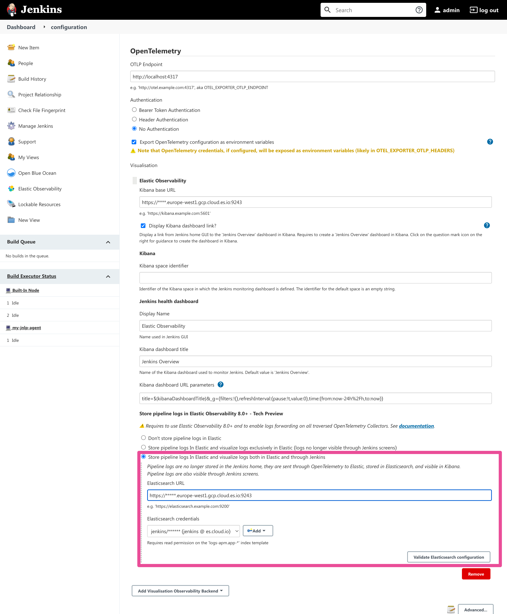

# Storing Jenkins Pipeline Logs in an Observability Backend though OpenTelemetry (version 2.0.0+)

Jenkins pipeline build logs can be sent through OpenTelemetry Protocol in order to be stored in an observability backend alongside the traces of the pipeline builds and the health metrics of Jenkins. Doing so provides the following benefits
* Better observability, monitoring, alerting, and troubleshooting of the Jenkins instance thanks to the unification of all the signals in the observability backend
* Better traceability and audit of the Software Delivery Lifecycle having better control on the long term storage of the builds
* Better scalability and reliability of Jenkins greatly reducing the quantity of data stored in Jenkins home and limiting the well known file system performance of Jenkins when storing a large history of builds  

> **_BEST PRACTICE:_** When sending Jenkins pipeline logs through OpenTelemetry, it is recommended to deploy OpenTelemetry Collectors next to the Jenkins deployment for improved scalability and reliability.

## Storing Jenkins Pipeline Logs in Elastic

> **_PRE REQUISITES:_** storing Jenkins pipeline logs in Elasticsearch requires :
> * Elastic Observability version 8.1+
> * The OTLP endpoint configured on the Jenkins OpenTelemetry integration MUST be reachable from the Jenkins Agents (don't specify a `localhost` OTLP endpoint unless OpenTelemetry collectors are also deployed on the Jenkins Agents)  
> * When using OpenTelemetry Collectors, requires setting up a logs pipeline in addition to the traces and metrics pipelines. See FAQ below 

To store pipeline logs in Elastic, 

* Navigate to the OpenTelemetry section of Jenkins configuration screen, 
* Ensure the OTLP configuration is set
* Add the Elastic Observability backend
* Set the Kibana URL
* Click on the "Advanced" button to choose the storage integration strategy


### Storing Jenkins Pipeline Logs in Elastic visualizing logs in Kibana

The Jenkins OpenTelemetry provides turnkey storage of pipeline logs in Elasticsearch with visualization in Kibana.
The Jenkins pipeline build console then displays a hyperlink to Kibana rather than displaying the logs.


Example configuration:


### Storing Jenkins Pipeline Logs in Elastic visualizing logs both in Kibana and through the Jenkins build console

The Jenkins OpenTelemetry can also store of pipeline logs in Elasticsearch proving visualization of pipeline logs in Kibana while continuing to display them through the Jenkins pipeline build console.




This more advanced setup requires connecting from the Jenkins Controller to Elasticsearch with read permissions on the `logs-apm.app` and preferably on the Metadata of the ILM policy of this index template (by default it's the `logs-apm.app_logs-default_policy` policy).  

Please use the "Validate Elasticsearch configuration" to verify the setup.




## FAQ

### Enabling logs forwarding on the OpenTelemetry Collector

OpenTelemetry collectors requires to define a [logs pipeline](https://opentelemetry.io/docs/collector/configuration/#service) in order to transfer the logs received by the receivers like the [OTLP receiver](https://github.com/open-telemetry/opentelemetry-collector/tree/main/receiver/otlpreceiver) to the observability backends. 

Minimalistic example of an OpenTelemetry Collector transferring all signals, traces, metrics, and logs, to  Elastic Observability.  

````yaml
receivers:
  otlp:
    protocols:
      grpc:
        endpoint: '0.0.0.0:4317'
        # auth: enable authentication when needed
  #...
processors:
  batch:
exporters:
  otlp/elastic:
    endpoint: "***.apm.***.gcp.cloud.es.io:443"
    headers:
      Authorization: "Bearer ****"
service:
  pipelines:
    metrics:
      receivers: [otlp]
      processors: [batch]
      exporters: [otlp/elastic]
    traces:
      receivers: [otlp]
      processors: [batch]
      exporters: [otlp/elastic]
    logs:
      receivers: [otlp]
      processors: [batch]
      exporters: [otlp/elastic]
````

For more details, se the OpenTelemetry Collector [configuration guide](https://opentelemetry.io/docs/collector/configuration/).

### From where are the pipeline logs emitted? The Jenkins Controller? The Jenkins Agents? Both?

Pipeline logs are emitted both from the Jenkins controller and the Jenkins Agents according to where the code that emit logs is executing.
This means that the Jenkins agents establish a connection to the OpenTelemetry endpoint

### How are OpenTelemetry signals impacted by clock de-synchronization between the Jenkins controller and Jenkins Agents?

As The Jenkins OpenTelemetry logs integration evaluates the time offset between the system clocks on the Jenkins Controller and the Jenkins Agents. This offset is applied on the timestamp of the log messages emitted from the Jenkins Agents.
This means that the timestamp of log messages emitted on the Jenkins Agents doesn't rely on the system clock of the agent but on the time on the Jenkins Controller with a compensation.
This clock adjustment is required to display in the right ascending order the log messages.
Note that distributed traces don't require such a clock adjustment because all spans are emitted from the Jenkins Controller.

### Can pipeline logs be stored in other backends than Elastic?

Yes any observability backend that support OpenTelemetry logs  

### Can the Jenkins server logs and the logs of other types of jobs like Freestyle or Matrix jobs be sent through OpenTelemetry to be stored outside of Jenkins?

We would like to implement this as well, it's an Open Source initiative, contributions are welcome